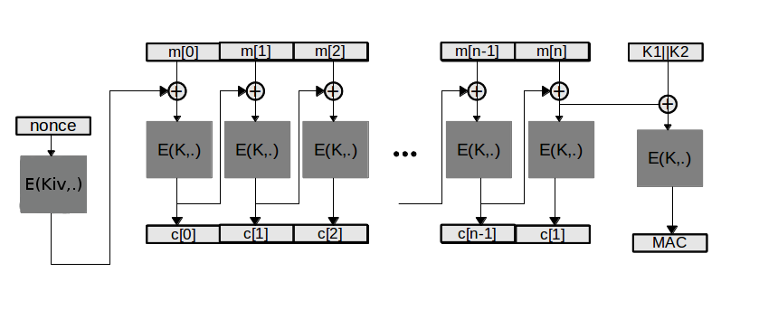

AES-CMAC
=======

(AES128)
---------------

Implementação do mode de cifra CBC sobre a cifra por blocos (AES-128), juntamente com a técnica para construção de MAC CMAC.

Representation
----------



Nonce/Iv pode ser aleatório ou um contador.
A cifra do nonce é necessária quando o mesmo é um contador, ou é previsível. Caso o mesmo seja calculado de modo aleatório esta passo não é necessário.


KEY
----

Chave total é composta por K + Kiv + K1 + K2.


K-chave usada na cadeia CBC

Kiv- chave usada na pré-cifra do nonce/IV usado na cadeia cbc

K1- chave usada no calculo do MAC quando não é necessário acrescentar padding á msg de modo a completar o ultimo bloco.

K2- chave usada no calculo do MAC quando é necessário acrescentar padding á msg de modo a completar o ultimo bloco.


Run
--------------
```sh
make
./testcbc
```


    
